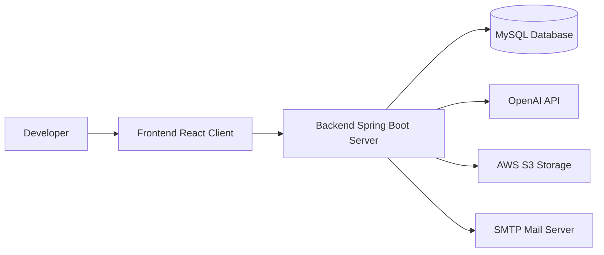

# DRAVIX SCM — Supply Chain Management System

## 🚀 Overview

**DRAVIX SCM** is a production-grade, AI-powered agricultural supply-chain management (SCM) platform. The system connects multiple roles—including Administrators, Suppliers, Warehouse Owners, Warehouse Managers, Logistics Managers, Drivers, and Customers—into a unified, automated logistics workflow. 

By integrating automated OCR document compliance checks, fuzzy name matching, intelligent route dispatching, interactive 3D package models, and geospatial route mapping, DRAVIX SCM streamlines agricultural trading, warehousing, and transportation while maintaining top-tier security standards and auditability.

---

## ✨ Key Features

The system implements role-specific views and controls, fully verified by backend role validations:

*   **Administrator Dashboard:** Complete system overview, manager administration, configuration settings, system policies control, and audit logs analysis.
*   **Supplier Portal:** Agricultural product listing management, pricing controls, inventory monitoring, market forecasting charts, and revenue reporting.
*   **Warehouse Management:** Storage capacity optimization, stock verification, dispatch workflows, location adjustments (secured by OTP), and claims handling.
*   **Logistics Coordination:** Fleet registration, route search preferences (adjustable search radius), driver dispatching, shipment tracking, and revenue-sharing analysis.
*   **Driver Mobile Workspace:** Route navigation maps, delivery/availability status updates, and delivery verification using OTP codes.
*   **Customer Portal:** Product catalog browser, shopping cart, interactive delivery address management, live dispatch tracking on OpenStreetMap, and delivery approval.
*   **AI Document Compliance & OCR:** Automatically extracts text from uploaded PAN/GST cards (using Tesseract OCR), runs Levenshtein fuzzy matching (>80% similarity threshold) to verify identity matching, and flags duplicate credentials.
*   **Intelligent Routing & Maps:** Geospatial navigation utilizing Leaflet maps, cached geocoding lookup responses in Caffeine Cache, Haversine formula calculation for distance metrics, and OSRM API routing paths.
*   **3D Cargo & Fleet Viewer:** Interactive 3D cargo scene using React Three Fiber and Three.js displaying shipment capacities and visual cargo states.
*   **Multi-Factor OTP Security:** OTP distribution via Spring Mail SMTP server required for sensitive modifications, such as warehouse geospatial coordinate adjustments.

---

## 🏗️ System Architecture

The following diagram illustrates the interaction between the React single-page frontend application, the Spring Boot REST API monolith gateway, the database persistent layer, and external cloud integrations:

```mermaid
graph TD
    subgraph Frontend ["Client Viewport (React 19 + Vite)"]
        A[SaaS Dashboard Hub] --> B[Leaflet Map Dispatch]
        A --> C[Three.js Landing Page Scene]
        A --> D[Document Compliance Center]
        A --> E[GSAP & Framer Motion UI Elements]
    end

    subgraph Backend ["REST API Gateway (Spring Boot 3.5.15)"]
        F[Spring Security + JWT Filter] --> G[Settings Controller]
        F --> H[Order & Dispatch Controller]
        F --> I[AI Verification & OCR Engine (Tess4J)]
        F --> J[Caffeine Cache Manager]
        F --> K[Java Mail Sender]
    end

    subgraph Database ["MySQL 8.0 Persistence"]
        L[(Hikari Connection Pool: supply_chain_db)]
    end

    subgraph Cloud ["External API & Storage Integrations"]
        M[AWS SDK: S3 Bucket Compliance]
        N[OpenAI Model API]
        O[OSRM Geocoding Routing Map]
        P[Gmail SMTP Mailer]
    end

    Frontend -- "HTTPS REST / JSON" --> Backend
    Backend -- "Hibernate ORM" --> Database
    Backend --> Cloud
```

---

## 🛠️ Technology Stack

### Frontend
- **Core Framework:** React (v19.2.6) (Functional Components, Context API)
- **Build Tool:** Vite (v8.0.12)
- **Styling:** Tailwind CSS (v4.3.1) via `@tailwindcss/vite` & Vanilla CSS custom variables
- **Animation & Transitions:** `framer-motion` (v12.41.0) & `gsap` (v3.15.0 with `@gsap/react` v2.1.2)
- **Maps & Geolocation:** `leaflet` (v1.9.4) & `react-leaflet` (v5.0.0)
- **3D Graphics:** `three` (v0.185.1), `@react-three/fiber` (v9.6.1), and `@react-three/drei` (v10.7.7)
- **Charts:** `recharts` (v3.8.1)
- **Icons:** `lucide-react` (v1.21.0) & `react-icons` (v5.6.0)

### Backend
- **Core Framework:** Spring Boot (v3.5.15)
- **Java Platform:** Java SDK 17
- **Build Tool:** Maven (POM configuration)
- **Security:** Spring Security, JWT tokenization (`jjwt-api` / `jjwt-impl` / `jjwt-jackson` v0.11.5), and BCrypt
- **Caching Engine:** Caffeine Cache (via `spring-boot-starter-cache`)
- **Excel Processing:** Apache POI (`poi-ooxml` v5.2.5)
- **Environment Management:** `dotenv-java` (v3.0.0)
- **Dev Tooling:** Lombok (v1.18.36)

### Database & Persistence
- **Database Engine:** MySQL 8.0+
- **Driver:** `mysql-connector-j`
- **Connection Pool:** HikariCP connection manager
- **Object Relational Mapping:** Hibernate / Spring Data JPA

### AI / ML & OCR
- **Spring AI:** `spring-ai-openai-spring-boot-starter` (v1.0.0-M6)
- **OCR Library:** `tess4j` (v5.10.0) wrapping the native Tesseract OCR engine
- **Fuzzy Matching:** `commons-text` (v1.11.0) using Levenshtein distance calculations

### Maps / Geospatial
- **Leaflet & React Leaflet** (Map interface components)
- **OSRM API** (Open Source Routing Machine route path queries)
- **OpenStreetMap** (Map tile layers provider)
- **Haversine formula** (Java backend distance calculation)

### 3D
- **Three.js, React Three Fiber, React Three Drei**

### Security
- **RBAC**: Custom security filters mapping endpoints to user roles on the backend; conditional dashboards on the frontend.
- **OTP Verification**: Custom `OtpService` triggers OTP distribution via Spring Mail for sensitive actions.

### DevOps / Deployment
- **Docker:** Multistage `Dockerfile` in backend (Maven compilation -> Temurin JRE runtime with `tesseract-ocr` installation)
- **Vercel:** Frontend routing configuration in `vercel.json`

---

## 📁 Repository Structure

```text
capstone/
├── supply-chain-system/        # React Frontend Application
│   ├── public/                 # Static assets (logos, images, videos)
│   ├── src/                    # React components, pages, hooks, context
│   │   ├── pages/              # Onboarding, dashboards, and role settings
│   │   │   └── settings/       # Role-specific settings panels (Admin, Supplier, etc.)
│   │   └── index.css           # Core styling tailwind & custom variables
│   ├── package.json            # NPM scripts & package dependencies
│   ├── vercel.json             # Vercel deployment routes rewrite rules
│   └── vite.config.js          # Vite configuration parameters
├── supply-chain-backend/       # Spring Boot REST API Backend
│   ├── src/                    # Java source code
│   │   ├── main/
│   │   │   ├── java/com/scms/  # Controllers, Services, Repositories, Entities, Config
│   │   │   └── resources/      # Application properties, templates, static components
│   │   └── test/               # Integration & unit test suites
│   ├── Dockerfile              # Multi-stage backend containerization configuration
│   ├── pom.xml                 # Maven build dependencies & plugin targets
│   └── tessdata/               # OCR training data models
├── .env.example                # Sample environment configurations template
├── LICENSE                     # MIT License
└── README.md                   # Project documentation (this file)
```

---

## ⚙️ Installation & Setup

### Prerequisites
*   **Java JDK 17** installed and configured in system path
*   **Node.js** (v18.x or higher)
*   **Maven** (v3.9.x or higher)
*   **MySQL Server** (v8.0 or higher) local instance running

---

### 1. Backend Setup

1.  **Navigate to the backend directory:**
    ```bash
    cd supply-chain-backend
    ```

2.  **Configure Environment Variables:**
    Create a `.env` file in the `supply-chain-backend` directory or configure the environment variables locally. Refer to the table below or the root `.env.example` file for setup:
    ```env
    PORT=8082
    JWT_SECRET=YOUR_JWT_SECRET
    SPRING_DATASOURCE_URL=jdbc:mysql://localhost:3306/supply_chain_db?createDatabaseIfNotExist=true
    SPRING_DATASOURCE_USERNAME=YOUR_DATABASE_USERNAME
    SPRING_DATASOURCE_PASSWORD=YOUR_DATABASE_PASSWORD
    SPRING_MAIL_USERNAME=YOUR_GMAIL_USERNAME
    SPRING_MAIL_PASSWORD=YOUR_GMAIL_APP_PASSWORD
    OPENAI_API_KEY=YOUR_OPENAI_API_KEY
    AWS_ACCESS_KEY_ID=YOUR_AWS_ACCESS_KEY
    AWS_SECRET_ACCESS_KEY=YOUR_AWS_SECRET_KEY
    AWS_REGION=ap-south-1
    AWS_S3_BUCKET_NAME=YOUR_S3_BUCKET_NAME
    ENCRYPTION_SECRET=YOUR_ENCRYPTION_SECRET
    ```

3.  **Run the Backend:**
    ```bash
    ./mvnw spring-boot:run
    ```
    Or if you have Maven installed locally:
    ```bash
    mvn spring-boot:run
    ```
    The REST API server will start at `http://localhost:8082`.

---

### 2. Frontend Setup

1.  **Navigate to the frontend directory:**
    ```bash
    cd ../supply-chain-system
    ```

2.  **Install Package Dependencies:**
    ```bash
    npm install
    ```

3.  **Configure Environment Variables:**
    Create a `.env` file in the `supply-chain-system` directory:
    ```env
    VITE_API_URL=http://localhost:8082
    ```

4.  **Run the Frontend Development Server:**
    ```bash
    npm run dev
    ```
    The React application will run at `http://localhost:5173`.

---

## 🔐 Security
- **Role-Based Access Control (RBAC):** Token authentication is validated on each API request against user profiles. Forbidden actions trigger a `403 Forbidden` response.
- **Geospatial OTP Guard:** Adjustments to physical warehouse coordinates (latitude/longitude) require a verified OTP code sent to the warehouse owner's registered email before changes are persisted.
- **Secure File Storage:** Sensitive compliance documentation uploaded during user onboarding is encrypted client-side or using server-side AES-256 SSE-S3 storage class filters before being stored in the AWS S3 Bucket.

---

## 🤖 AI Features
- **Tesseract OCR (Tess4J):** Automatically parses documents uploaded in the compliance dashboard to extract metadata such as GST and PAN numbers.
- **Levenshtein Fuzzy Verification:** A string comparison metric verifies the document name against the user profile. If the similarity is above 80%, the document is auto-approved.
- **Spring AI Integrations:** Employs OpenAI Models to detect risk factors, perform fraud audits, and recommend logistics vehicle assignments.

---

## 🗺️ Maps & Geospatial Features
- **Leaflet Dispatch Mapping:** Renders routes dynamically using Leaflet marker mappings.
- **OSRM Pathfinding:** Connects dispatch centers with delivery addresses using live path routing coordinates.
- **District Caching:** Geocoding coordinates are stored in Caffeine Cache to minimize external network lookups.
- **Haversine Math:** Distance gaps are calculated server-side using coordinate arithmetic.

---

## 🚚 3D / Visualization
- **React Three Fiber & Drei:** Integrates interactive 3D cargo scene simulations on dashboards, showing item configurations, cargo space utilization, and shipment loading status.

---

## 🧪 Testing

### Running Backend Tests
Execute unit and integration tests configured in Maven:
```bash
mvn test
```

### Running Frontend Linter
Lint Javascript source code using ESLint:
```bash
npm run lint
```

---

## 📦 Production Build

### Frontend Compilation
Generate static production chunks:
```bash
npm run build
```
The output files will be compiled inside the `dist/` directory.

### Backend Packaging
Compile and package the monolithic REST API into a single JAR file:
```bash
mvn package -DskipTests
```
The compiled archive will be saved under `target/supply-chain-backend-0.0.1-SNAPSHOT.jar`.

---

## 🌐 Deployment
*   **Backend:** Can be deployed in container environments (using the provided `Dockerfile` which installs native `tesseract-ocr` libraries and copies local `tessdata` parameters) or run directly as a compiled jar. Exposes port `10000` by default in container configurations.
*   **Frontend:** Tailored for hosting providers like Vercel with path rewrites configured in `vercel.json`.
*   *Otherwise, deployment configuration depends on the hosting environment.*

---

## 🔒 Environment Variables

| Variable | Purpose | Required |
|---|---|---|
| `PORT` | Local port mapping configuration (Defaults to `8082`) | No |
| `JWT_SECRET` | 256-bit key used to sign authentication tokens securely | Yes |
| `SPRING_DATASOURCE_URL` | JDBC database connection endpoint string | Yes |
| `SPRING_DATASOURCE_USERNAME` | MySQL database connection username | Yes |
| `SPRING_DATASOURCE_PASSWORD` | MySQL database connection password | Yes |
| `SPRING_MAIL_USERNAME` | Gmail address for sending automated OTPs and logs | Yes |
| `SPRING_MAIL_PASSWORD` | Gmail application password credential | Yes |
| `OPENAI_API_KEY` | API token required to start OpenAI model routines | Yes |
| `AWS_ACCESS_KEY_ID` | Access credential for Amazon S3 bucket storage | Yes |
| `AWS_SECRET_ACCESS_KEY` | Secret credential for Amazon S3 bucket storage | Yes |
| `AWS_REGION` | Geographic region configuration for S3 bucket (`ap-south-1`) | Yes |
| `AWS_S3_BUCKET_NAME` | Storage bucket name for compliance files | Yes |
| `ENCRYPTION_SECRET` | Document encryption secret key | Yes |

---

## 🧩 Development Workflow



---

## 📌 Project Status
- **Core Status:** Production-ready with fully compilable frontend and backend projects.
- **Build Integrity:** Checked and certified on Java 17 and Node.js v18+.

---

## 📜 License
This project is licensed under the MIT License - see the [LICENSE](file:///c:/Users/dharu/OneDrive/Desktop/capstone/LICENSE) file for details.

---

## 👨‍💻 Project Credits
- **DRAVIX SCM Development Team**
- Leaflet map integration powered by OpenStreetMap contributors.
- 3D visualizations enabled by Three.js community contributors.
